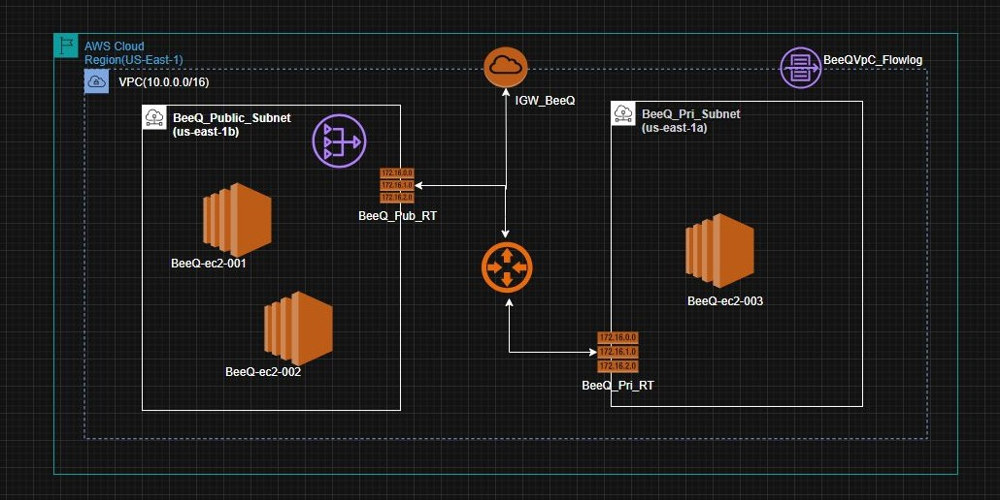

A Virtual Private Cloud (VPC) is a logically isolated network in Amazon Web Services where you can launch AWS resources such as EC2 instances, databases, and load balancers.
A VPC allows you to:
1.	Control IP addressing 
2.	Create public and private subnets 
3.	Configure routing 
4.	Improve security and network isolation
________________________________________
BeeQ LLC Final Reference Architecture.

________________________________________
Step 1: Log in to AWS Console
Go to the:  AWS Management Console
Then:
1.	Sign in to BeeQ LLC AWS account 
2.	Search for VPC 
3.	Open the VPC dashboard 
________________________________________
Step 2: Create a VPC.
1.	In the VPC Dashboard, click Create VPC 
2.	Select VPC only 
3.	Enter the following:
Setting	         Value
Name tag                   	         BeeQVPC
IPv4 CIDR block	         10.0.0.0/16
Tenancy	          Default
________________________________________
Step 3: Create Public Subnets
Private Subnet 1 (Private subnets do not allow direct internet access.)
Setting                     	    Value
Name                      	    BeeQ_Pri_Subnet
Availability Zone	    us-east-1a
CIDR	    10.0.3.0/24
Private Subnet 2 (Public subnets allow direct internet access.)
Setting		  	Value  
Name			BeeQ_Public_Subnet
Availability Zone			us-east-1b
CIDR			10.0.4.0/24
________________________________________
Step 4: Create an Internet Gateway and attach it to the VPC.
An Internet Gateway allows communication between the VPC and the internet.
1.	Click Create Internet Gateway. 
2.	Name: IGW_BeeQ 
3.	Click Attach to VPC. 
________________________________________

Step:5 Create a Route Table for Public Subnets and Private Subnets
Create Public Route Table
1.	Go to Route Tables 
2.	Click Create route table. 
3.	Name: BeeQ_Public-RT 
4.	Select your BeeQVPC 
Add Internet Route
1.	Open the route table. 
2.	Edit routes. Add a destination target (0.0.0.0/0) route to the internet. Associating with the subnet enables the resource in the subnet to communicate with the public Internet.
3.	Create another route table without a destination target to the internet. Associate with the private subnet (BeeQ_Pri_Subnet). At this stage, private subnets have no internet access.
________________________________________
Step 6: (Optional) Create NAT Gateway
A NAT Gateway allows private subnet resources to access the internet securely. Deploy the NAT Gateway in the public subnet (BeeQ_Public_Subnet).
Steps
1.	Go to NAT Gateways 
2.	Click Create NAT Gateway. 
3.	Select: Public subnet 
4.	Allocate Elastic IP 
________________________________________
Step 7: Update Private Route Table
Add route:
Destination	Target
0.0.0.0/0	NAT Gateway
Now private subnet instances can access the internet for updates and downloads.
________________________________________

